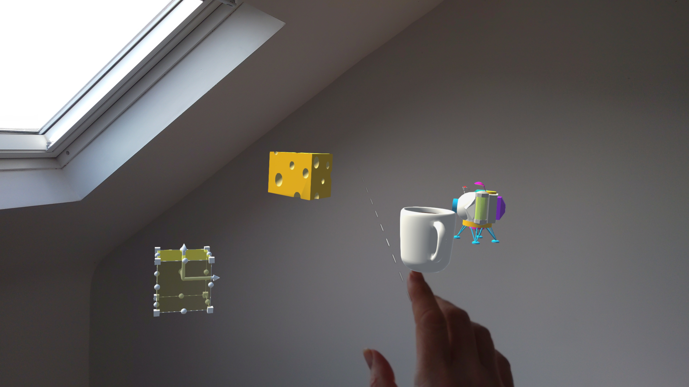

# Local Anchors

This sample uses the OpenXR API for local anchors on a HoloLens 2. There is an official sample [here](https://github.com/microsoft/OpenXR-Unity-MixedReality-Samples) that this is based on but the scenario is different. I wanted to be able to position a single, local and persistent anchor within my 3D environment and use that position as the root for all content. 

I had previously used world anchors and worldanchorstore but this API is a little different.

## Usage

The transparent cube is used to position a local anchor in space so you can use far interactions or near interactions to position the cube and when the interaction ends a local anchor is created at that position and rotation.

The small axis mesh will show where there is currently a local anchor.

The content under the `ActualContent` parent gameObject will be re-parented under the anchored gameObject root. Subsequently introduced content would also be parented unfer that gameObject.

If you close the app and restart the anchor and the content will be positioned relative to where you left it.

